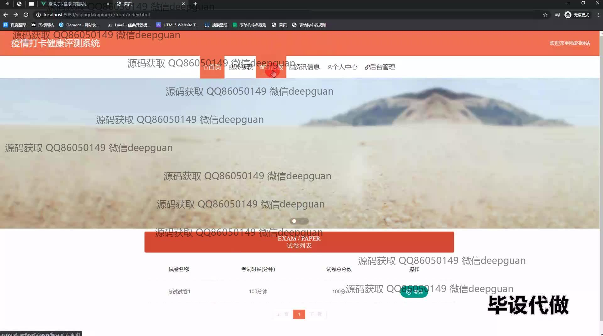
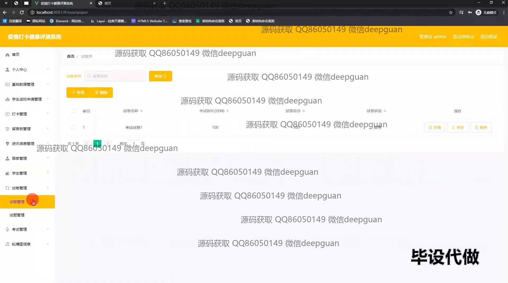
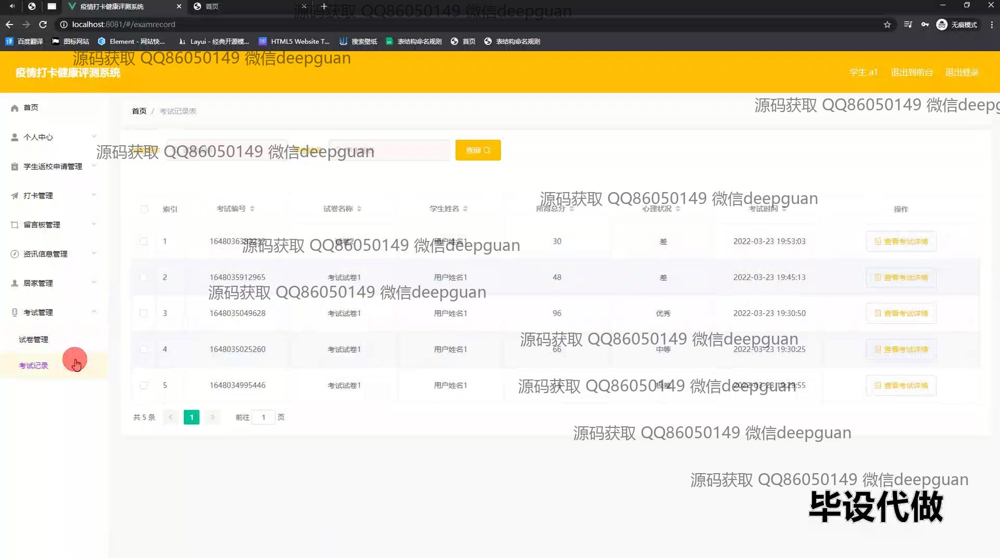

<h1 align="center">疫情打卡健康评测系统</h1>

## 简介
疫情打卡健康评测系统：角色分为管理员、用户；功能包括健康信息管理、考试打卡、试题管理、资讯管理、学生返校申请审核等。系统界面简洁明了，便于用户操作与健康数据管理。    --计算机毕业设计源码；毕设源码；java毕业设计源码

## 联系方式

<h3 align="center">获取完整代码与数据库文件 + 微信：deepguan QQ: 86050149 QQ群: 783742310</h3>

<h3 align="center">可帮忙远程部署 包运行成功！提供远程部署、修改代码、设计文档指导、代码讲解等服务！</h3>

## 功能介绍（完整见运行截图）
管理员： 基本功能包括登录、退出及切换界面模块。提供个人中心、基本信息管理、打卡管理、学生信息管理等功能模块。用户可以通过这些功能实现居住状态管理、考试记录查看、试题管理及学生返校申请管理等操作。同时，管理员可以通过留言板、资讯信息管理等功能模块进行信息发布和交流。

用户： 主要功能集中在个人健康评估和考试管理。通过个人中心访问个人信息，查看考试记录及心理健康评估。用户可以在考试卷库中查看考试试题，参与在线考试并提交答案。用户中心提供健康数据的打卡及管理功能，同时允许用户查看和编辑试题库，参与健康及考试信息的反馈和完善。

学生： 提供在线考试评估和健康打卡功能，通过登录个人账户，学生可以查看自身信息，包括考试成绩、心理状态评估等。学生能够申请返校，并向管理员提交健康码状态，通过系统参与健康数据打卡，获取健康资讯及参与相关考试，便于进行自我健康管理。

访问者： 系统主页展示包括资讯展示板块、用户反馈机制及健康试题等功能，通过导航栏访问网站不同模块，获取疫情期间的健康管理资讯。同时，通过考试卷库、留言板与健康资讯模块，访问者可以体验平台提供的部分公开功能，增加对系统的了解。

## 运行截图

本代码来源于网络,仅供学习参考使用!

